  

# Hi there, I'm Deogracious Moriasi 👋

### 🚀 Full-Stack Developer | Open for Opportunities
I build fast, responsive, and scalable web applications. Currently focused on creating clean frontend user experiences with React and building robust backend services using Node.js and Python.

- 💼 **Looking for:** Full-Time Roles / Junior Developer Roles / Internship Opportunities
- 🌱 **Currently learning:** [e.g., Advanced System Design / Next.js / TypeScript]
- 💬 **Ask me about:** React, Tailwind CSS, REST APIs, or Python automation

---

### 🛠️ Tech Stack & Tools

**Frontend Development**

**Backend & Databases**

**Tools & Platforms**

---

### 📂 Featured Projects
*Recruiters: Check out these pinned repositories for full code architecture!*

1. **Bizika** - A full-stack react application learning management system. Built with React, Firebase, and Tailwind.

---

### 📬 Connect with Me
[][https://www.linkedin.com/in/deogracious-moriasi-2a0941318/]
[][]
